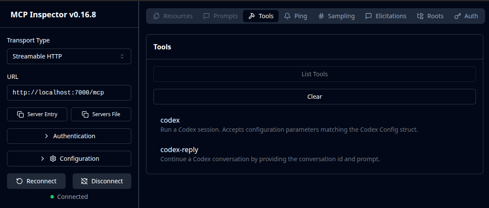

# Codex Streamable HTTP Server

The built-in MCP server of Codex CLI natively uses the STIO JSON-RPC transport. In this mode, Codex reads JSON-RPC messages from its standard input (`stdin`) and sends messages to its standard output (`stdout`).

Codex Streamable HTTP Server, on the other hand, exposes an HTTP server using the Streamable HTTP transport.
In the Streamable HTTP transport, the server operates as an independent process that can handle multiple client connections. This transport uses HTTP POST and GET requests.

## Usage

- Build image: `make`
- Codex login: `make login`
- Run codex as Streamable HTTP MCP server: `make run`
- Codex logout: `make logout`
- Remove docker container, image and volume: `make clean`

The Streamable HTTP Server uses tcp port 7000: http://localhost:7000/mcp

You can check by `npx @modelcontextprotocol/inspector`

## Security

When implementing Streamable HTTP transport:

- Servers MUST validate the `Origin` header on all incoming connections to prevent DNS rebinding attacks
- When running locally, servers SHOULD bind only to localhost (`127.0.0.1`) rather than all network interfaces (`0.0.0.0`)
- Servers SHOULD implement proper authentication for all connections

Check [Model Context Protoclo Specification](https://modelcontextprotocol.io/specification/versioning) to learn more.

## Codex Authentication

Codex CLI uses the information in `/home/$USER/.codex/auth.json` for authentication, and `/home/$USER/.codex/config.toml` for configuration. The same directory also contains technical logs and session logs.

To persist the authentication token, a named volume `codex-config` has been configured in `docker-compose.yml`.

There are several ways to perform the login:

- Use `make login`, which relies on `docker-compose-login.yml`
- Install Codex on the host, log in with `codex login`, and share `/home/$USER/.codex/` with the container instead of the named volume
- Manually copy `auth.json` into the named volume

### make login

The Codex CLI login mechanism binds an HTTP server to TCP port 1455 to receive the OAuth 2.0 callback.
Since the binding is hardcoded to `127.0.0.1` instead of `0.0.0.0` and cannot be configured, it’s not possible to expose the service to the host directly from Docker. The workaround of `make login` creates a DNAT rule to bypass this limitation.

This hack requires a privileged container (`root`) with `NET_ADMIN` and `net.ipv4.conf.eth0.route_localnet: 1`.
